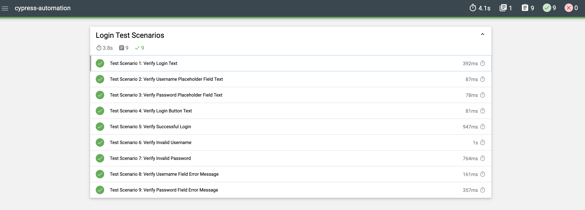

## Page Object Model Pattern with Cypress

## **Cypress Testing Setup**
## Overview
This repository contains Cypress end-to-end tests for your application. Cypress is used to automate and run tests on the application, ensuring that all features are working as expected.

**Prerequisites**
Before running the tests, ensure you have the following installed:

Node.js (version 12 or higher)
Cypress (or use npx to run it without global installation)

## Visit the repository below and follow the steps outlined.
https://github.com/SeeJaneHire/BhaskarNaga-SDETAssignment/tree/main

**The steps for starting the system are as below:**
Download the attached zip file and unzip the file on your local
Download all dependencies with `npm install` or `yarn install`
Start the system with `npm start` or `yarn start`
The valid username and password are `test` and `test`

**Getting Started****
1. Clone the Repository
First, clone the repository to your local machine:
`git clone https://github.com/your-repo-url.git`
`cd your-repo-directory`

2. Install Dependencies
Download all dependencies with `npm install`

3. Set Up Environment Variables
Cypress uses environment variables for configuration. You must define the CYPRESS_BASE_URL to specify the base URL for your tests.

**Option 1: Using .env File**
Create a .env file in the root directory of your project.
Add the following line to define the BASE_URL and US_PWD

**Option 2: Setting the Environment Variable Directly**
On macOS/Linux: bash
`export CYPRESS_BASE_URL=http://localhost:3000`

On Windows (PowerShell): powershell
`$env:CYPRESS_BASE_URL="http://localhost:3000"`

On Windows (Command Prompt): cmd
`set CYPRESS_BASE_URL=http://localhost:3000`

4. Configuration in cypress.config.js
Cypress is configured to use the environment variable CYPRESS_BASE_URL in the cypress.config.js file.

5. Run Cypress Tests
Once you've set up the environment variable, you can run Cypress tests.

Open Cypress in Interactive Mode: `npx cypress open`

6. Execute Cypress tests in headless mode by running: `npx cypress run`. The test results will be displayed in the terminal.

7. After the tests finish running, you can view the generated HTML report in your browser. 
   The report will be located in: `cypress/reports/mochawesome/mochawesome.html` and looks like this.
   

**Writing Tests**
Cypress tests are located in the cypress/e2e folder by default. Each test file is a separate suite of tests, and you can write multiple tests in each file using the `it()` and `describe()` functions.

**Troubleshooting**
## Cypress Not Finding the Environment Variable
If you're seeing `null` for the `BASE_URL`, ensure that:

The `.env` file is located in the root directory of the project.
You have the correct key-value pair in the `.env` file or have set the environment variable in your terminal session.